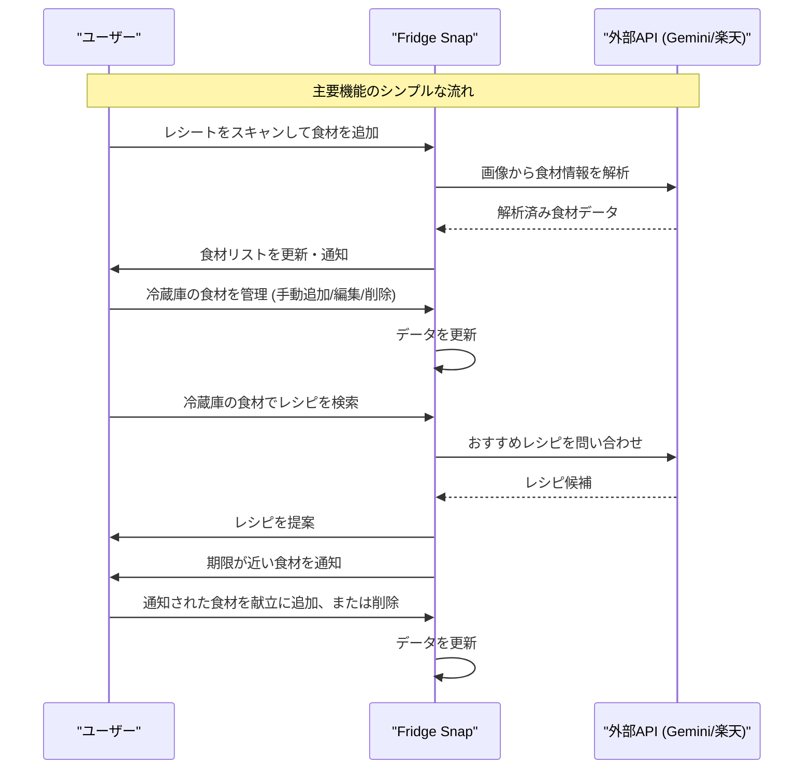

```mermaid
sequenceDiagram
    participant User as "ユーザー"
    participant App as "Fridge Snap"
    participant ExternalAPIs as "外部API (Gemini/楽天)"

    Note over User, ExternalAPIs: 主要機能のシンプルな流れ

    %% 食材追加
    User->>App: レシートをスキャンして食材を追加
    App->>ExternalAPIs: 画像から食材情報を解析
    ExternalAPIs-->>App: 解析済み食材データ
    App->>User: 食材リストを更新・通知

    %% 冷蔵庫管理
    User->>App: 冷蔵庫の食材を管理 (手動追加/編集/削除)
    App->>App: データを更新

    %% レシピ提案
    User->>App: 冷蔵庫の食材でレシピを検索
    App->>ExternalAPIs: おすすめレシピを問い合わせ
    ExternalAPIs-->>App: レシピ候補
    App->>User: レシピを提案

    %% 期限管理
    App->>User: 期限が近い食材を通知
    User->>App: 通知された食材を献立に追加、または削除
    App->>App: データを更新
```